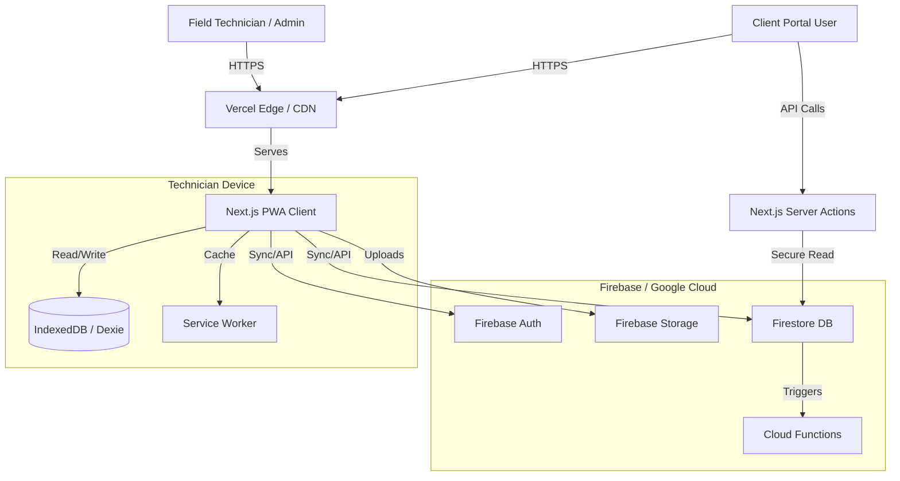

# Jeotronix PWA - Technical Architecture

This document outlines the technical architecture for the Jeotronix PWA, designed to facilitate field service reporting, offline capabilities, and a scalable Client Portal.

## 1. High-Level Architecture

The application uses a **Serverless / Cloud-Native** architecture leveraging **Next.js** for the frontend and **Firebase** for backend services. It is designed with a **Hybrid Data Access Model**: PWA for field techs (Direct Firestore + Offline Sync) and Portal for clients (Server Actions API).

---

## 2. Security & Data Separation (Client Portal Ready)

### 2.1 Role-Based Access Control (RBAC)
We distinguish three primary roles defined in `users/{userId}.role`:
1.  **Admin**: Full system access.
2.  **Technician**: Field operations, write access to own logs, read access to all clients (or assigned zone).
3.  **Client**: Restricted read-only access.
    -   **Constraint**: Must have a valid `linkedClientId` in their profile.
    -   **Scope**: Can ONLY view data where `clientId == linkedClientId`.

### 2.2 Firestore Security Rules (Boundaries)
-   **Strict Multi-Tenancy**: All queries from Client users are validated against their `linkedClientId`.
-   **Immutable History**: Clients cannot edit logs. Technicians cannot delete completed logs.

### 2.3 API Design & Middleware
-   **Technician App**: Direct Firestore SDK (Client-side) for Offline support.
-   **Client Portal**: 
    -   **Route**: `/portal/*` (Protected by Middleware).
    -   **Data Access**: **Server Actions** only. This prevents exposure of Firestore logic and allows strict business logic enforcement (e.g., "only show approved reports").
    -   **Middleware**: `src/middleware.ts` enforces that `/portal` routes are only accessible by users with the `client` role.

---

## 3. Offline Strategy (Technicians Only)

Since technicians may work in areas with poor connectivity, "Offline-First" is a core requirement. Clients do not need offline support.

### 3.1. Asset Caching (Service Worker)
-   **Library**: `next-pwa` (Workbox)
-   **Strategy**: Stale-While-Revalidate for App Shell.

### 3.2. Data Persistence (IndexedDB)
-   **Library**: `Dexie.js`
-   **Usage**: Technicians download assigned jobs. Reports are queued in `syncQueue` and processed via `src/lib/sync-engine.ts`.

---

## 4. Firebase Structure (Data Model)

### Collections

1.  **`users`**
    - `uid`: string
    - `role`: 'admin' | 'technician' | 'client'
    - `linkedClientId`: string (Required for 'client' role)

2.  **`clients`**
    - `id`: auto-id
    - `name`: string
    - `type`: 'corporate' | 'residential'

3.  **`service_logs`**
    - `id`: auto-id
    - `clientId`: string (ref)
    - `technicianId`: string (ref)
    - `status`: 'draft' | 'completed'
    - `jobType`: 'ict' | 'solar'
    - `ictData` / `solarData`: Polymorphic fields

4.  **`knowledge_base`**
    - `attachments`: array of file metadata

---

## 5. Reporting & Exports

-   **PDF Generation**: Client-side (jspdf) for instant feedback for Techs. Server-side (Cloud Functions) for automated monthly emailing.
-   **Analytics**: `recharts` for visualization of battery health trends and issue frequency.

---

## 6. Scalability Plan

1.  **Optimization**: 
    -   `next/dynamic` imports for heavy charting/PDF libs.
    -   `optimizePackageImports` in Next.js config.
    -   Fonts optimization (`next/font`).
2.  **Query Efficiency**: 
    -   Compound indexes on `[clientId, date]` and `[technicianId, date]`.
    -   Pagination for all list views.